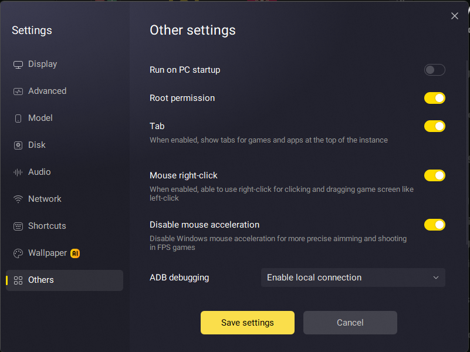

# Installing Kitsune Magisk on LDPlayer 14 (Android 14)

This guide walks you through installing **Kitsune Magisk** on **LDPlayer 14** running **Android 14**.

## Prerequisites

Before you begin, make sure you have the Kitsune Magisk APK downloaded and ready to install.

## Steps

### 1. Enable Required Settings

In LDPlayer settings, enable the following options:

- **Root**
- **Writable System**



### 2. Install the Kitsune Magisk APK

Install the Kitsune Magisk APK file inside the emulator, just like you would install any other APK.


### 3. Open a Root Shell

Open a terminal (via ADB or a terminal emulator app inside LDPlayer) and enter root mode:

```bash
su
```


### 4. Remount the Filesystem as Writable (if needed)

If the root filesystem is mounted as read-only, remount it as read-write:

```bash
mount -o remount,rw /
```


### 5. Run the Bootstrap Script

Create the `/sbin` directory, set the correct permissions, and run the Magisk bootstrap setup:

```bash
mkdir /sbin
chmod 755 /sbin

/system/etc/init/magisk/magisk64 \
    --setup-sbin \
    /system/etc/init/magisk \
    /sbin
```


### 6. Reboot the Emulator

Restart LDPlayer to complete the installation.


## Done

After the reboot, Kitsune Magisk should be fully installed and active on your LDPlayer 14 (Android 14) instance.
